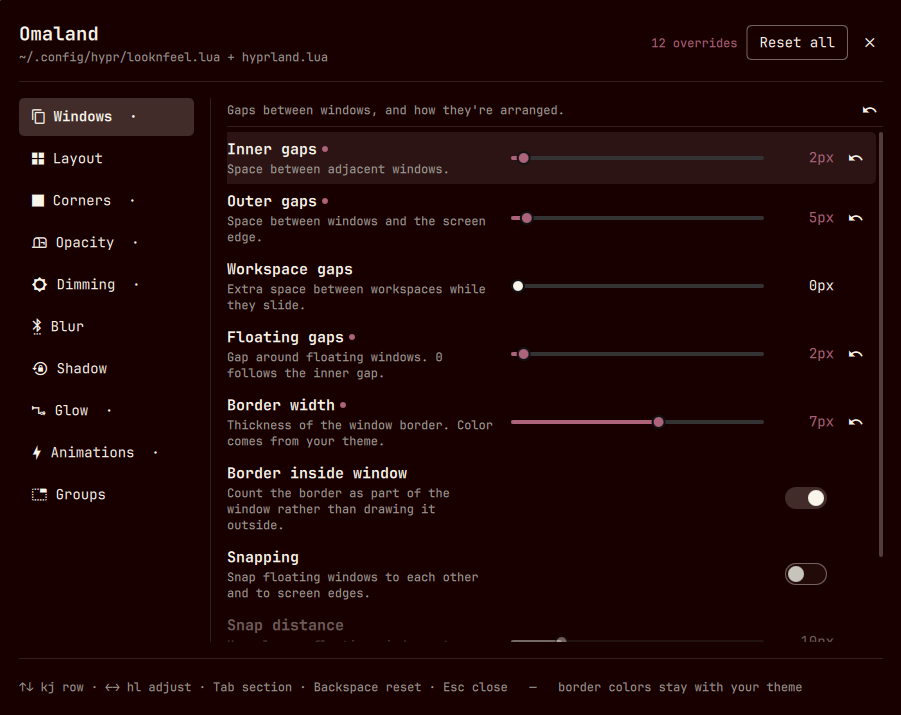

# Omaland

A GUI for Hyprland's visual look and feel, as an Omarchy shell plugin. Applies
live as you drag; saves plain Lua into your Hyprland config.

Built for **Omarchy 4.x** (Hyprland ≥ 0.56, Lua config). Also needs `lua`,
which `hyprland` already depends on. No network access, no elevated privileges.



## Install

```bash
omarchy plugin add https://github.com/bobby-nicholas/omaland.git --enable --yes
```

Then add it to the launcher, so **SUPER+SPACE › Omaland** opens it:

```bash
ln -sf ~/.config/omarchy/plugins/bobbynicholas.omaland/omaland.desktop \
       ~/.local/share/applications/
```

Omarchy has no install hook for plugins, so this one step is manual. Without
it, the only way in is `omarchy-shell shell toggle bobbynicholas.omaland`.

<details>
<summary>Optional: put it in the Omarchy menu too</summary>

Add this to `~/.config/omarchy/extensions/omarchy-menu.jsonc` to turn
**Style › Hyprland** into a submenu. Redeclaring the id with no `action` flips
it to a submenu, and the original editor action moves into a child:

```jsonc
"style.hyprland": {"icon":"","label":"Hyprland","aliases":["hyprland","looknfeel"]},
"style.hyprland.omaland": {"icon":"󰸌","label":"Visual Editor","aliases":["omaland"],"action":"omarchy-shell shell toggle bobbynicholas.omaland"},
"style.hyprland.edit": {"icon":"","label":"Edit Config","action":"omarchy-launch-config-editor \"$HOME/.config/hypr/looknfeel.lua\""},
```

</details>

## Remove

```bash
omarchy plugin remove bobbynicholas.omaland --yes
rm -f ~/.local/share/applications/omaland.desktop
```

Your settings stay — they are plain Lua in the files Hyprland already reads. To
undo them too, hit **Reset all** first; that clears both managed blocks and
restores the files byte for byte.

## What it edits

| Section | Options |
|---|---|
| **Windows** | gaps in/out/workspaces/floating, border width, border inside window, snapping |
| **Layout** | tiling engine, plus the active engine's own knobs (`dwindle:*`, `master:*`, `scrolling:*`) |
| **Corners** | rounding, roundness curve |
| **Opacity** | full opacity, focused, unfocused, fullscreen |
| **Dimming** | dim unfocused, strength, special workspace, dim around, dim behind modals |
| **Blur** | enabled, size, passes, noise, contrast, brightness, vibrancy, x-ray, special, popups |
| **Shadow** | enabled, range, falloff, scale, sharp |
| **Glow** | enabled, range, falloff |
| **Animations** | enabled, wrap workspaces, speed multiplier |
| **Groups** | group bar height, font size, titles, indicator, rounding, gradients, stacked |

## Keys

| | |
|---|---|
| `↑` `↓` / `k` `j` | move between rows |
| `←` `→` / `h` `l` | adjust the current row |
| `Tab` / `Shift+Tab` | next / previous section |
| `Space` `Enter` | toggle |
| `Backspace` | reset the row to the Omarchy default |
| `Esc` | close |

## Notes

**Colors stay with your theme.** Omarchy themes own `general:col:*` from a file
that loads before `looknfeel.lua`, so anything Omaland wrote there would pin
your borders and break `omarchy theme set`.

**Full opacity** clears the `opacity = "0.985 0.96"` rule Omarchy applies to
every window. That rule multiplies with the opacity sliders, so without the
switch 100% still renders at 0.985.

**Where it writes.** One fenced block per file — `hl.config` and `hl.animation`
in `looknfeel.lua`, `o.window` rules in `hyprland.lua`. Nothing outside the
fences is touched, and clearing every override removes the blocks and restores
both files exactly. Uninstalling changes nothing; your settings are already
where Hyprland reads them.

**Live preview** uses `hyprctl eval` (Hyprland's Lua parser rejects `hyprctl
keyword`), handed the same Lua that gets written on release, so preview and
saved state can't drift. `hyprctl configerrors` runs after every write and
surfaces in the footer.

**Reading state back** is done by Lua, not by a parser. `read.lua` runs the
block against recording stubs for `hl` and `o` and reports what it set, so the
block stays pure Lua with no state comments, and a hand-edit that breaks the
syntax gets a real Lua error instead of being silently misread. Needs
`/usr/bin/lua`, which Hyprland already depends on.

## Development

```
manifest.json    plugin declaration (kind: panel)
Panel.qml        state, hyprctl processes, file IO, layout
OptionRow.qml    one option row
Schema.js        the option catalogue
LuaConfig.js     render the managed blocks, read read.lua's output
read.lua         runs a block against recording stubs to report what it set
test/run.js      node test/run.js
```

Adding an option is one entry in `Schema.js`. Plugin QML is cached by URL, so
edits need `omarchy restart shell`.

## License

MIT
