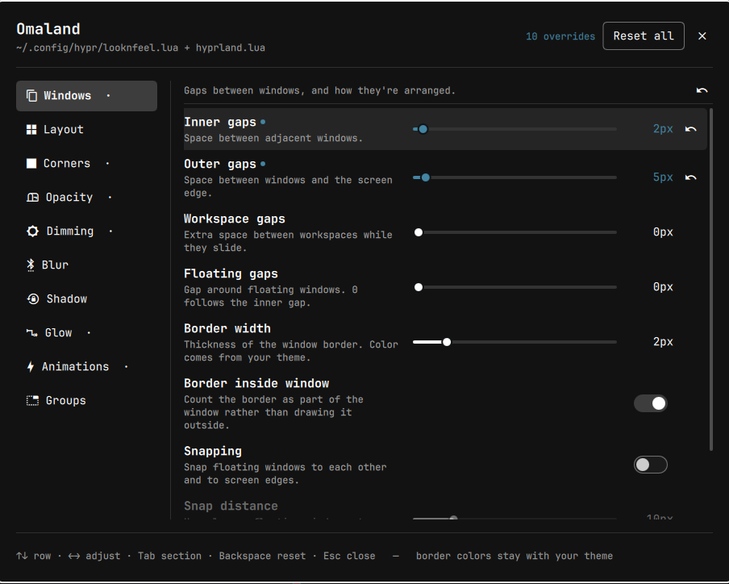

# Omaland

A GUI for the visual half of Hyprland's look and feel, as an Omarchy shell
plugin. Sliders and switches for gaps, corners, opacity, dimming, blur, shadow,
glow, and animation speed — applied live as you drag, and saved into your
Hyprland config as plain Lua you could have typed yourself.

Built for **Omarchy 4.x** (Hyprland ≥ 0.56, Lua config).

```
Style > Hyprland > Visual Editor        # from the Omarchy menu (SUPER+SPACE)
omarchy-shell shell toggle omaland      # from anywhere
```



## What it edits

| Section | Options |
|---|---|
| **Windows** | `gaps_in`, `gaps_out`, `gaps_workspaces`, `float_gaps`, `border_size`, `border_part_of_window`, `snap:enabled`, `snap:window_gap`, `snap:monitor_gap` |
| **Layout** | `general:layout`, plus the active engine's own knobs — `dwindle:*`, `master:*` or `scrolling:*`. The other engines' rows are hidden, not greyed out. |
| **Corners** | `rounding`, `rounding_power` |
| **Opacity** | Full opacity switch, `active_opacity`, `inactive_opacity`, `fullscreen_opacity` |
| **Dimming** | `dim_inactive`, `dim_strength`, `dim_special`, `dim_around`, `dim_modal` |
| **Blur** | `enabled`, `size`, `passes`, `noise`, `contrast`, `brightness`, `vibrancy`, `vibrancy_darkness`, `xray`, `special`, `popups` |
| **Shadow** | `enabled`, `range`, `render_power`, `scale`, `sharp` |
| **Glow** | `enabled`, `range`, `render_power` |
| **Animations** | `enabled`, `workspace_wraparound`, plus a speed multiplier over Omarchy's shipped animation set |
| **Groups** | Group bar geometry: `enabled`, `height`, `font_size`, `render_titles`, `indicator_height`, `rounding`, `gradients`, `stacked`, `disable_when_only`. Its `col:*` and `text_color*` keys stay with the theme. |

### What it deliberately does not edit

**Colors.** Omarchy themes own `general:col:active_border`,
`general:col:inactive_border`, and the group border colors, via
`~/.local/state/omarchy/current/theme/hyprland.lua`. That file is loaded
*before* `hypr/looknfeel.lua`, so anything Omaland wrote there would win
permanently and your borders would stop following `omarchy theme set`. Border
color belongs to the theme; Omaland stays out of it.

Also out of scope by design: keybindings, monitors and scaling, and input.

### Full opacity

The Opacity sliders drive Hyprland's *global* defaults
(`decoration:active_opacity` and friends), but Omarchy separately pins nearly
every window with a rule in `$OMARCHY_PATH/default/hypr/windows.lua`:

```lua
o.window(".*", { tag = "+default-opacity" })
o.window({ tag = "default-opacity" }, { opacity = "0.985 0.96" })
```

The rule and the globals **multiply**, so on stock Omarchy a 100% slider still
renders at 0.985 focused / 0.96 unfocused — windows are never quite opaque.

The **Full opacity** switch clears that ceiling by re-applying the rule at 1.0:

```lua
o.window(".*", { opacity = "1 1" })
```

This goes in `hyprland.lua`, not `looknfeel.lua` — see below. It loads after
Omarchy's defaults, so it wins. Same result as `SUPER+BACKSPACE`
(`omarchy-hyprland-window-transparency-toggle`) gives one window, applied to
all of them — verified identical pixel-for-pixel. The sliders keep working
below it, since the globals still multiply on top.

This is the one window rule Omaland writes; everything else it manages is
`hl.config`.

## How it writes

Omaland owns one fenced block per file, and never touches a byte outside them.
It splits the same way Omarchy does:

| File | Holds |
|---|---|
| `~/.config/hypr/looknfeel.lua` | `hl.config` settings and `hl.animation` leaves |
| `~/.config/hypr/hyprland.lua` | `o.window` rules — only the Full opacity switch writes here |

Omarchy ships no user `windows.lua` and nothing requires `hypr.windows`; the
stock `hyprland.lua` template's own example for personal config is
`o.window("qemu", { workspace = "5" })` at the bottom of that file, so that's
where window rules belong. The second file is only created when a setting needs
it, and the block is removed again when it doesn't.

The looknfeel block looks like this:

```lua
-- >>> omaland managed block >>>
-- Written by Omaland. Safe to hand-edit: Omaland re-reads this block
-- every time it opens, and only ever rewrites what's between the fences.
hl.config({
  decoration = {
    rounding = 12,

    blur = {
      enabled = true,
      size = 6,
    },
  },

  general = {
    gaps_in = 8,
  },
})
-- <<< omaland managed block <<<
```

That is ordinary Lua in the file the Omarchy docs already point you at, placed
where a hand-written override would go — after Omarchy's defaults, so it wins.
Anything you write above the fences is preserved verbatim. Hand-edit inside the
fences too if you like; Omaland reparses the block every time it opens, and
picks up external edits while it's open.

When the last override is cleared, the block is removed entirely and the file
returns to exactly what it was before.

### Live preview and persistence are the same code path

Hyprland's Lua parser rejects the old live-tweak route:

```
$ hyprctl keyword decoration:rounding 12
keyword can't work with non-legacy parsers. Use eval.
```

So Omaland previews with `hyprctl eval` — handing it the *identical Lua body*
it will later write to disk. One renderer feeds both paths, so what you see
while dragging and what ends up in the file cannot drift apart.

| | |
|---|---|
| dragging a slider | `hyprctl eval '<body>'` — instant, in memory, no file touched |
| letting go | the same `<body>` spliced into `looknfeel.lua`, then `hyprctl reload` |
| resetting an option | key dropped from the block, file written, `hyprctl reload` |

When a change touches both files, the reload waits until both writes have
landed, so Hyprland never reads a half-written pair.

Resets go through the file because Hyprland has no "unset this option" — the
only way back to a default is to reload a config that doesn't mention the key.
After every write Omaland runs `hyprctl configerrors` and shows anything
Hyprland complains about in the footer.

Because the state lives in your Hyprland config and nowhere else, uninstalling
Omaland changes nothing: your settings are already where Hyprland reads them.

### The animation speed multiplier

Hyprland has no global animation speed knob — each leaf carries its own
duration. The slider re-emits all of Omarchy's `hl.animation` leaves with their
durations divided by the multiplier (Hyprland's third field is a duration in
deciseconds, so higher multiplier = shorter = faster).

The baseline is read at runtime from
`$OMARCHY_PATH/default/hypr/looknfeel.lua`, never from Omaland's own previous
output. So the multiplier always scales the shipped set, can't compound across
adjustments, and follows upstream if Omarchy retunes its animations. Setting it
overrides hand-tuned `hl.animation` lines elsewhere in your config.

## Controls

| | |
|---|---|
| `↑` `↓` | move between rows |
| `←` `→` | adjust the current row (step a slider, cycle a picker, flip a switch) |
| `Tab` / `Shift+Tab` | next / previous section |
| `Space` `Enter` | toggle the current row |
| `Backspace` | reset the current row to the Omarchy default |
| `Esc` | close |

An accent dot marks any option Omaland is overriding, on both the row and its
section in the rail. The ↺ buttons reset a single row or a whole section;
**Reset all** clears the block entirely. Those two are mouse-only on purpose —
they throw away more than one setting.

Sliders show comfortable ranges, not Hyprland's absolute limits. If an option
is already set outside its range — by hand, or by a future Omarchy default —
the track widens to include it rather than clamping your value.

## Install

Omaland is a plain plugin directory with a `manifest.json`:

```bash
omarchy plugin add https://github.com/bobby-nicholas/omaland.git --enable --yes
```

Or by hand, from a local checkout:

```bash
ln -s ~/projects/omaland ~/.config/omarchy/plugins/omaland
omarchy-shell shell rescanPlugins
omarchy plugin enable omaland
```

### Menu entry

`~/.config/omarchy/extensions/omarchy-menu.jsonc` turns the existing
**Style > Hyprland** row into a submenu offering the visual editor or the raw
file. Redeclaring an id with no `action` flips its inferred kind to a submenu,
so no Omarchy source is touched:

```jsonc
"style.hyprland": {"icon":"","label":"Hyprland","aliases":["hyprland","looknfeel"]},
"style.hyprland.omaland": {"icon":"󰸌","label":"Visual Editor","aliases":["omaland"],"action":"omarchy-shell shell toggle omaland"},
"style.hyprland.edit": {"icon":"","label":"Edit Config","action":"omarchy-launch-config-editor \"$HOME/.config/hypr/looknfeel.lua\""},
```

For a direct keybinding, add to `~/.config/hypr/bindings.lua`:

```lua
o.bind("SUPER + SHIFT + L", "Omaland", "omarchy-shell shell toggle omaland")
```

## Development

```
manifest.json    plugin declaration (kind: panel)
Panel.qml        the panel: state, hyprctl processes, file IO, layout
OptionRow.qml    one option — label, description, and slider/switch/picker
Schema.js        the option catalogue: keys, types, ranges, dependencies
LuaConfig.js     render and parse the managed block; the animation baseline
```

Adding an option is a one-line entry in `Schema.js` — `LuaConfig.js` derives
the Lua table path from the hyprctl key, and `Panel.qml` renders whatever the
type says.

Plugin QML is cached by URL, so edits need a real restart to take effect:

```bash
omarchy restart shell
```
